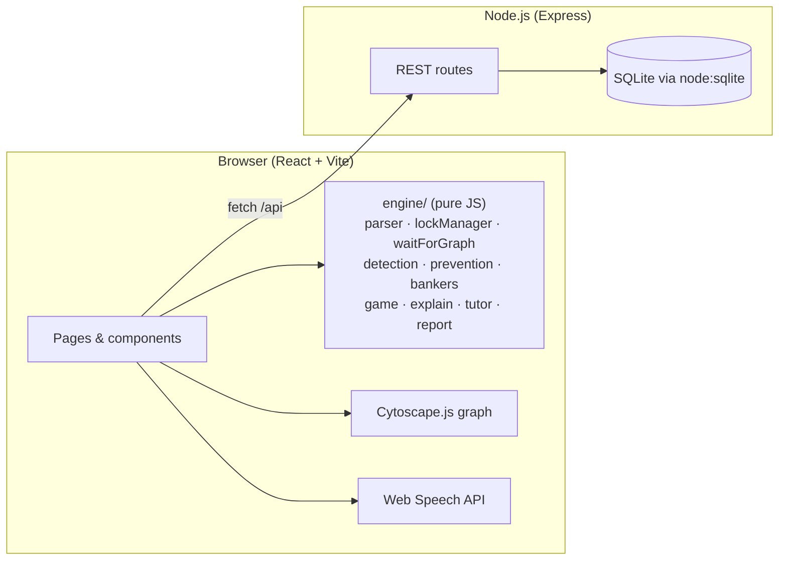

# Deadlock Game — Project Documentation

## 1. Problem definition

Develop an interactive web application that teaches and demonstrates **deadlocks in DBMS
transaction processing** through visualization, simulation and AI-assisted explanations.
Students enter a lock schedule (or Banker's matrices), watch the algorithm run step by step,
read a generated explanation for every step, ask the tutor questions, and can play a game
in which they act as the lock scheduler.

## 2. Background theory

### 2.1 Locks and waits
Under lock-based concurrency control a transaction needs a **shared (S)** lock to read and an
**exclusive (X)** lock to write a data item. Only S/S is compatible; every other combination
conflicts and the requester **waits**. Two-phase locking (2PL) guarantees serialisability but
*not* freedom from deadlock.

### 2.2 Deadlock
A **deadlock** is a set of transactions in which each member waits for a lock held by another
member. In the **wait-for graph (WFG)** — nodes = transactions, edge Ti → Tj = "Ti waits for
Tj" — a deadlock exists **iff** the graph contains a cycle.

### 2.3 Coffman conditions
Mutual exclusion · hold-and-wait · no preemption · circular wait. Every strategy below
breaks at least one of them.

### 2.4 Three strategies
| Strategy | Idea | Typical use |
|---|---|---|
| **Detection** | Let deadlocks happen; search the WFG for a cycle; roll back a victim | MySQL InnoDB, PostgreSQL, SQL Server, Oracle |
| **Prevention** | Order lock requests by timestamp so a cycle can never form (wait-die, wound-wait) | Distributed DBMS, textbooks |
| **Avoidance** | Grant a request only if the resulting state is *safe* (Banker's algorithm) | OS resource allocation; DBMS theory |

### 2.5 Real-world use cases
* **InnoDB** checks the WFG on every lock wait and rolls back the transaction that modified the fewest rows.
* **PostgreSQL** waits `deadlock_timeout` (1 s) before running detection and returns error 40P01.
* **SQL Server** runs a lock monitor every 5 s and picks the victim by `DEADLOCK_PRIORITY`, then rollback cost (error 1205).
* Application-level: lock resources in a consistent order, keep transactions short, `SELECT … FOR UPDATE` to avoid upgrade deadlocks, retry on deadlock errors.

### 2.6 Limitations of the approaches
* Detection costs O(V+E) per check and wastes the victim's work.
* Prevention aborts transactions that would never have deadlocked and needs timestamps.
* Avoidance requires knowing each process's maximum demand in advance — unrealistic for DBMS transactions.

## 3. Learning outcomes
After using the application a student should be able to:
1. Explain what a deadlock is and state the Coffman conditions.
2. Build a wait-for graph from a lock table and detect a cycle with DFS.
3. Apply wait-die and wound-wait to a schedule and predict which transaction aborts.
4. Run the Banker's safety and resource-request algorithms by hand.
5. Interpret the visualization (node colours/shapes, edges, lock table, timeline) and choose a deadlock-free schedule in the game.

## 4. Architecture



* **Engine** — dependency-free, deterministic, fully unit-tested. Every simulator returns an
  array of *step snapshots* (`lockTable`, `wfg`, `dfs` trace, `statuses`, `explanation` …) so the
  UI can scrub backwards and forwards without re-running anything.
* **UI** — three-pane dashboard (input · visualization · explanation). Simulator pages stay
  mounted so switching tabs keeps their state. Theme tokens are CSS custom properties.
* **Server** — persistence (history, game scores, tutor logs), Markdown/JSON export, analytics
  aggregates, sample scenarios, and an optional proxy to a free-tier LLM for the AI tutor (the only
  external call, and only when a key is configured).

### 4.1 Input specification
Lock schedules — one operation per line, case-insensitive, `#`/`--` comments:

```
T1: LOCK-X(A)   T1: X(A)   T1: UPDATE A | WRITE A | INSERT A | DELETE A   → exclusive lock
T1: LOCK-S(B)   T1: S(B)   T1: SELECT B | READ B                          → shared lock
T1: UNLOCK(A)   T1: U(A)
T1: COMMIT      T1: ABORT
```
Validation: syntax, unknown operation, unlock of a never-requested lock, operation after
commit/abort, redundant lock, empty schedule, > 12 transactions or > 12 items.

Banker's — `Available` vector, `Max` and `Allocation` matrices (rows = processes), optional
request `(pid, vector)`. Validation: non-negative integers, consistent dimensions,
Allocation ≤ Max, request bounds.

### 4.2 Output specification
* Visual: wait-for graph (animated DFS, cycle in red), lock table (changed rows flash),
  per-transaction timeline, Banker's matrices with Work/Finish, safe sequence chips.
* Textual: title + explanation + "why it matters" for every step; step log; tutor answers.
* Downloadable: Markdown report, JSON bundle (re-importable), PNG of the graph.
* Validation messages with line numbers.

### 4.3 API
| Route | Purpose |
|---|---|
| `GET /api/health` | liveness |
| `GET /api/samples` | built-in scenarios |
| `GET/POST /api/history`, `GET/DELETE /api/history/:id`, `DELETE /api/history` | saved runs |
| `GET /api/history/:id/export?format=md\|json` | downloadable report |
| `GET/POST /api/scores` | game results, best per level |
| `POST /api/tutor-log` | tutor Q&A log |
| `GET /api/analytics` | aggregates for the dashboard |
| `GET /api/ai/status`, `POST /api/ai/ask` | optional LLM tutor (Gemini / Groq / OpenRouter / OpenAI-compatible via `server/.env`); 503 when not configured |

Schema: `simulations(id, mode, title, input_json, result_json, summary, deadlocks, steps, created_at)`,
`game_scores(id, level, level_name, score, moves, hints_used, deadlocked, created_at)`,
`tutor_logs(id, simulation_id, mode, question, intent, answer, created_at)`.

## 5. Algorithms

| Component | Algorithm | Complexity | Why chosen |
|---|---|---|---|
| Lock manager | S/X compatibility matrix, FIFO wait queue, upgrade-first re-grant | O(holders) per request | Standard textbook lock manager |
| WFG construction | edge from each waiter to every conflicting holder | O(R·T) | Direct from the lock table |
| Cycle detection | iterative DFS, white/grey/black colouring, records a trace for animation | **O(V+E)** | Linear; the trace makes the search teachable |
| Victim selection | youngest / oldest / fewest locks / requester | O(cycle) | Mirrors real policies (InnoDB ≈ fewest changes) |
| Wait-die / wound-wait | timestamp comparison on conflict; restart keeps timestamp | O(1) per request | Classic prevention schemes (Silberschatz §18.2) |
| Banker's safety | Work/Finish loop | **O(n²·m)** | Standard algorithm |
| Banker's request | need/available checks + tentative safety run | O(n²·m) | Standard algorithm |
| Game hints | DFS over the reachable state space with memoisation | exponential in ops, tiny for ≤ 4 txns × 5 ops | Exact "is a win still reachable?" answer |
| Tutor (offline) | normalise → entity extraction → regex intent table → data-driven template; "what-if" re-runs the simulators | O(steps) | Deterministic, offline, explainable |
| Tutor (AI) | prompt = system rules + compact run summary (`summarizeForAi`) + offline engine's answer + last 6 turns → free-tier LLM via plain `fetch` | one HTTP call | Natural explanations, grounded in the engine's facts; key stays server-side |

### 5.1 Detection loop (pseudocode)
```
while an op of a non-blocked, non-committed transaction remains:
    LOCK   → request; if granted: GRANT step
             else: mark blocked; build WFG; DFS
                   if cycle: DEADLOCK_DETECTED step, choose victim,
                             release its locks (wake waiters), requeue its ops → VICTIM step
    UNLOCK → release; re-grant FIFO waiters
    COMMIT → release all; wake waiters
END step (reports transactions still waiting for never-released locks)
```

### 5.2 Prevention decision
```
conflict: Ti requests item held by {Tj}
wait-die  : if every Tj younger than Ti → Ti WAITs   else Ti DIEs (restart, same TS)
wound-wait: wound every younger Tj (they restart); if an older holder remains → Ti WAITs
```

## 6. Non-functional requirements
* **Responsive** — three columns ≥ 1100 px, two columns ≥ 900 px, single column below; tabs wrap on phones.
* **Modular** — engine has zero dependencies and is imported by both client and server (samples, reports).
* **Accessibility** — landmarks, `aria-live` explanation banner, keyboard stepping (← → Space Home End), focus-visible rings, `prefers-reduced-motion`, node states encoded by colour **and** shape.
* **Performance** — the largest sample simulates in < 5 ms; the UI shows the elapsed time. All pages respond well under 2 s.
* **Cross-browser** — standard ES2020, Web Speech API is optional (button hidden when unsupported).

## 7. Limitations of the simulator
* Two lock modes on named items only (no intention/range locks).
* Requests compatible with current holders are granted immediately (no queue-order fairness rule).
* Detection runs after every blocked request rather than on a timer.
* Restarted transactions are appended to the end of the schedule.
* Game hints enumerate the full state space, feasible only for small levels.

## 8. References
1. Silberschatz, Korth, Sudarshan — *Database System Concepts*, 7th ed., ch. 18.
2. Elmasri, Navathe — *Fundamentals of Database Systems*, 7th ed., ch. 21.
3. Silberschatz, Galvin, Gagne — *Operating System Concepts*, 10th ed., ch. 8 (Banker's example).
4. Coffman, Elphick, Shoshani — "System Deadlocks", *ACM Computing Surveys* 3(2), 1971.
5. MySQL 8.0 Reference Manual — InnoDB deadlocks and deadlock detection.
6. PostgreSQL documentation — §13.3 Deadlocks; `deadlock_timeout`.
7. Microsoft Docs — SQL Server deadlocks guide.
